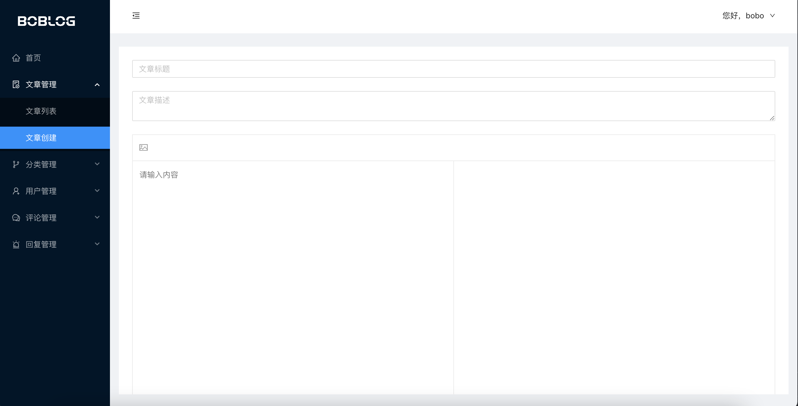

## React.js 博客管理后台

一个基于 React.js 完整的管理后台，包含登录权限，文章管理，分类管理，用户管理，评论管理，回复管理模块

- 技术栈：React.js, Reack-Hooks, react-redux, react-router, react-query
- UI 框架：Ant-Design

对应后端：
- Node.js 服务端 API 接口项目：[https://github.com/helin0815/nodejs-blog-backend](https://github.com/helin0815/nodejs-blog-backend)

## 安装启动
```
# 安装包
npm install 或者 yarn install

# 启动
npm start 或者 yarn start
```



